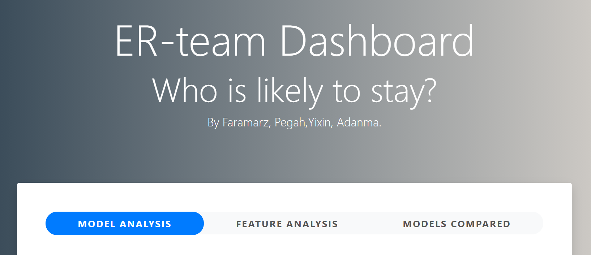
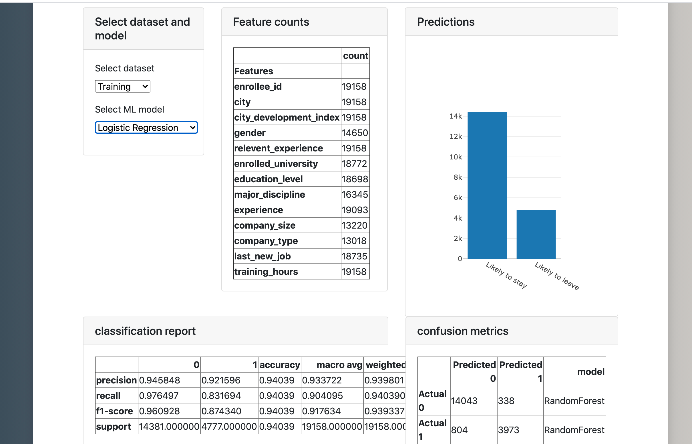
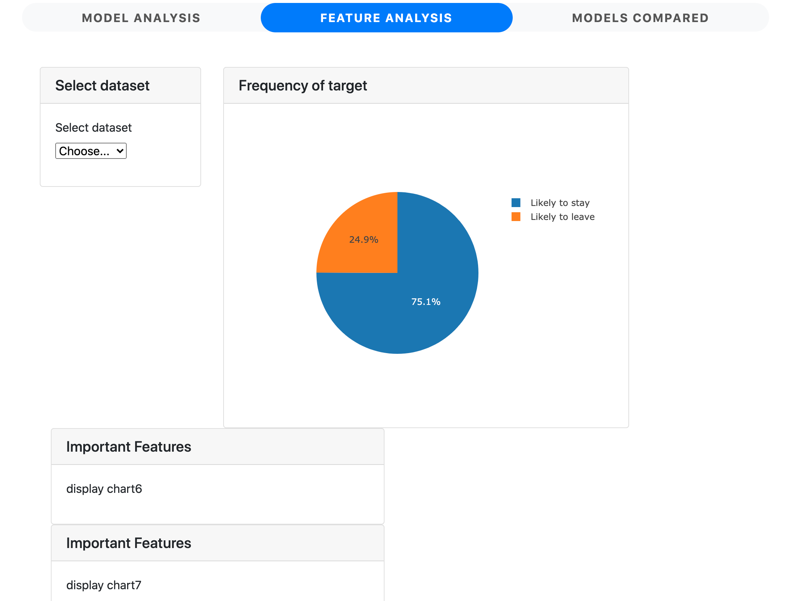
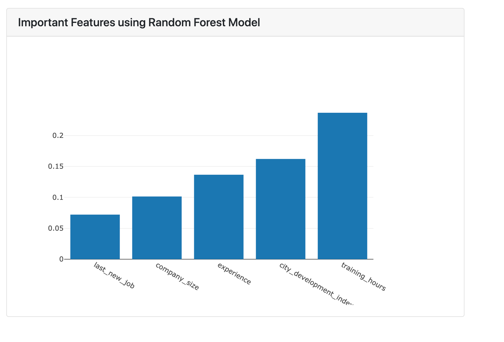
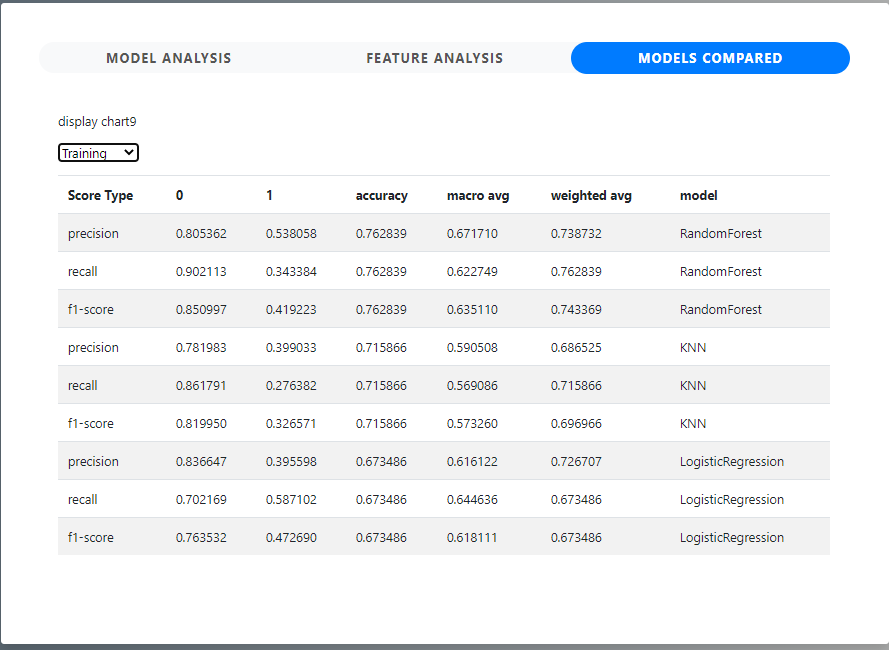

# Job-Change-of-Data-Scientists

|Segment Three Deliverables|Description|
|--------------|--------------------------------------------------------------------|
|Presentation|[Presentation-UPDATED SINCE SEGMENT 2](https://docs.google.com/presentation/d/1rMu07ryJqEmf5g0MFu4u5RzuQps3Q993OG1wDrHQeZc/edit?usp=sharing)|
|Presentation|[Storyboard- UPDATED SINCE SEGMENT 2](https://github.com/mermaidzhang/Job-Change-of-Data-Scientists/blob/main/README.md#dashboard) |
|Github|[Outline of the project](https://github.com/mermaidzhang/Job-Change-of-Data-Scientists/blob/main/README.md#overview)|
|Github|[Communication Protocols - UPDATED SINCE SEGMENT 2](https://github.com/mermaidzhang/Job-Change-of-Data-Scientists/blob/main/README.md#communications)|
|Machine Learning Model|[Data Cleaning & Processing](https://github.com/mermaidzhang/Job-Change-of-Data-Scientists/blob/main/README.md#data-exploration)|
|Machine Learning Model|[Machine Learning Model- Final Models - UPDATED SINCE SEGMENT 2](https://github.com/mermaidzhang/Job-Change-of-Data-Scientists/blob/main/README.md#machine-learning-model)|

# Overview
A data science company <b>`SaGe`</b> wants to hire new data scientists.  All the candidates must successfully pass the company’s in-house courses before being hired.  
Many candidates however, leave the company right after the training. This negatively affects <b>`SaGe`</b> in terms of money, time and planning. 

<b>`SaGe`</b> HR manager Adanma wants to know which candidates stay with the company after training. 

This analysis helps to: 

* Better select the candidates to enroll in the courses 
* Reduce the cost and time and quality of training
* Plan the courses and categorization of candidates

# Dataset
The [data set](https://www.kaggle.com/arashnic/hr-analytics-job-change-of-data-scientists) is taken from Kaggle 

The dataset is divided into train and test with same features with the exclusion of the target in the test data.

* The dataset is imbalanced. 
* Most features are categorical (Nominal, Ordinal, Binary), some with high cardinality. 
* Missing imputation that must be addressed in the pipeline.

## Features

|Feature|Description|
|--------------|--------------------------------------------------------------------|
|enrollee_id|Unique ID for candidate|
|city|City code|
|city_ development _index|Developement index of the city (scaled)|
|gender|Gender of candidate|
|relevent_experience|Relevant experience of candidate|
|enrolled_university|Type of University course enrolled if any|
|education_level|Education level of candidate|
|major_discipline|Education major discipline of candidate|
|experience|Candidate total experience in years|
|company_size|No of employees in current employer's company|
|company_type|Type of current employer|
|lastnewjob|Difference in years between previous job and current job|
|training_hours|training hours completed|
|target|0 – Not looking for job change, 1 – Looking for a job change|

## Data Structure
We created the below database structure for the above dataset 
Scripts for generating [database](https://github.com/mermaidzhang/Job-Change-of-Data-Scientists/blob/main/code/createDatabase.sql) and [tables](https://github.com/mermaidzhang/Job-Change-of-Data-Scientists/blob/main/code/createTables.sql)

## ERD
 

# Data Exploration
## Exploritory Analysis
The train data set contains 19158 rows and 13 columns. When we examine the data, there were a lot of NA Values in the data set(see chart below),  we deciced to use  <b>`na_randomfill`</b>function to fill in the features that have more than 30% of null value, then replace the null values in other columns with Others / Unknown. 

|features|missing_num percentage|
|--------------|--------------------------------------------------------------------|
|company_type|32.0493%|
|company_size	|30.9949%|
|gender|23.5306%|
|major_discipline|14.6832%|
|education_level	|2.4011%|
|last_new_job	|2.2080%|
|enrolled_university|2.0148%|
|experience|0.3393%|
|target|0%|
|company_size|0%|
|training_hours|0%|
|relevent_experience|0%|
|city_development_index|0%|
|city|0%|

## Feature Binning

To better achieve the results, we binned below features into different intervals. We also compared the ML results before bining and after binning the features. 

For experience have binned into three categories:Associtate, senior and Junior. 
|Binned Category|Counts|Years of Experience|
|--------------|--------------------------------------------------------------------|--------------------------------------------------------------------|
|associate|8010|<10 Yrs|
|senior|5590|11-18 Yrs|
|junior|5558|18+Yrs|

The City Development Index is calculated according to the formula :[(Infrastructure index + Waste index + Education index + Health index +
City Product index)/5](https://en.wikipedia.org/wiki/City_development_index)

Since city development index has separate sub-indices for Infrastructure, Waste Management, Health, Education, and City Product, which are also related to the population density in the city. Hence, we have binned into three categories:low density, medim density and high density. 
|Binned Category|Counts|Years of Experience|
|--------------|--------------------------------------------------------------------|--------------------------------------------------------------------|
|low density| 3430|<0.63|
|medim density|6167|0.63-0.91|
|high density |9561|0.91 and up|

Since there are 241 unique values under the training hours categories, we binned them into three major categories:
|Binned Category|Counts|Training Hours|
|--------------|--------------------------------------------------------------------|--------------------------------------------------------------------|
|0 to 100| 3430|<100 Hrs|
|101 to 250|6167|101-250 Hrs|
|251 and up|9561|More than 251 Hrs|

# Machine Learning Model

## Classification vs Regression

Classification is used to predict discrete outcomes. The outcome will be 0 or 1 , yes or no.
However regression is used to predict continuous varaibles.
In both classification and regression problems, a dataset is divided into features and target. 
Features are the variables used to make a prediction. Target is the predicted outcome.

The data set appears to be classification problem since the target is only binary, whether the person decides to stay or leave the company(0 and 1).To solve classification problems, we used [3 models](https://www.analyticsvidhya.com/blog/2020/11/popular-classification-models-for-machine-learning/) we have used in the Machine learning* and we aim to pick the best model to predict our hypothesis.

## Random Forest

Random Forest is  a popular method of classification than regression models, and it is a reliable ensemble of multiple Decision Trees.

## Logistic Regression

Logistic regression can be used for both regression and classification problems. Unlike regression which uses Least Squares, the model uses Maximum Likelihood to fit a sigmoid-curve on the target variable distribution.Logistic regression might be able to decide, based on personal information, whether an employee remain
in company or not. Multiple variables, such as an applicant's gender and education,are assessed to arrive at one of two answers: to remain or to leave the company.

## Kneasest Neigbors (KNN)

K-Nearest Neighbor (KNN) algorithm predicts based on the specified number (k) of the nearest neighboring data points. Here, the pre-processing of the data is significant as it impacts the distance measurements directly.It is also best to predict similarities patterns. Hence, if we were to decide the top features, KNN will be a good model to use. 

Above models are suitable for our agenda and the we compared the models to see which one is the best model based on Accuracy, Precision and Recall metrics.

## Models Comparison Before Binning

We  used  <b>`pd.concat`</b> function to compare the models:
Scores cross all models
|score type|0|1|accuracy|macro avg|weighted avg|model|
|--------------|--------------|--------------|--------------|--------------|--------------|--------------|
|precision|0.805362|0.538058|0.762839|0.671710|0.738732|RandomForest|
|recall|0.902113|0.343384|0.762839|0.622749|0.762839|RandomForest|
|f1-score|0.850997|0.419223|0.762839|0.635110|0.743369|RandomForest|
|support|3596.000000|1194.000000|0.762839|4790.00000|4790.000000|RandomForest|
|precision|0.781983|0.399033|0.715866|0.590508|0.686525|KNN|
|recall|0.861791|0.276382|0.715866|0.569086|0.715866|KNN|
|f1-score|0.819950|0.326571|0.715866|0.573260|0.696966|KNN|
|support|3596.000000|1194.000000|0.715866|4790.00000|4790.000000|KNN|
|precision|0.836647|0.395598|0.673486|0.616122|0.726707|LogisticRegression|
|recall|0.702169|0.587102|0.673486|0.644636|0.673486|LogisticRegression|
|f1-score|0.763532|0.472690|0.673486|0.618111|0.673486|LogisticRegression|
|support|3596.000000|1194.000000|0.673486|4790.00000|4790.000000|LogisticRegression|

As you can tell from above, Random Forest is the best model with the highest accuracy score. And the top features were discovered using <b>`rf_model.feature_importances_`</b>functions. 

Top Five Features
|Feature|Description|
|--------------|--------------------------------------------------------------------|
|training_hours|0.2367|
|city_development_index|0.1621|
|experience|0.1366|
|city|0.1045|
|company_size|0.1014|

## Models Comparison After Binning
We used the binned training_hours,city_development_index, and experience, then redo the modelling using Random Forest. 
Scores Using Binned Data 
|score type|0|1|accuracy|macro avg|weighted avg|model|
|--------------|--------------|--------------|--------------|--------------|--------------|--------------|
|precision|0.0.800399|0.503836|0.751983|0.671710|0.652118|RandomForest|
|recall|0.892102|0.329983|0.751983|0.611043|0.751983|RandomForest|
|f1-score|0.843766|0.398785|0.751983|0.621276|0.732846|RandomForest|
|support|3596.000000|1194.000000|0.762839|4790.00000|4790.000000|RandomForest|

Then our top five features are:

Top Five Features
|Feature|Importance|
|--------------|--------------------------------------------------------------------|
|city|0.2341|
|company_size|0.1763|
|last_new_job|0.1219|
|city_index_encoded|0.0874|
|company_type|0.0739|
|experience_encoded|0.0612|

## Final model
The binning really helps to build up the story, hence we decided to use the RF models after bining for our analysis. The top features are shown below 

# Technologies Used
## Data Cleaning and Analysis
Pandas will be used to clean the data and perform an exploratory analysis. Further analysis will be completed using Python.

## Database Storage
Postgres is the database we intend to use.

## Machine Learning
SciKitLearn is the ML library we'll be using to create a classifier. We will be using the Logistic regression model. This decision was based on the type of data that we are working.

## Dashboard
The purpose of the dashboard is to show the results of different ML models.  
We will use Bootstrap develop libraries for the presentation skin and Flask libraries for the backend python interaction.

There are three major tabs under our dashboard: Model Analysis, Feature Analysis & Models compared

1. Model Analysis
Under Model analysis, there are two drop-menus:Select Dataset and Select Models, which allow us to observe the interactive results of difference models and datasets. 

2. Feature Analysis
In the feature analysis tab, there are the basic analysis of top features we have concluded using Random Forest Sampling as well as the frequency of the target. 

3. Models Compared
In this tab, we will be able to switch between test and train to see the scroes across different models. 

# Project Management
## Team roles - 1st segment
* `Square`: YI XIN ZHANG. (Set up Github ripository) 
* `Triangle`: Pegah. (Mock Machine learning) 
* `Circle`: goes to Faramarz (Mock-up database) 
* `X-Role`: Adanma Eleweke (Which tools to choose for the project) 

## Team roles - 2nd segment
* `Code & README`: YI XIN ZHANG. 
* `Code`: Pegah. 
* `Code & Storyboard & Github Cleaning`:Faramarz 
* `Presnetaion`: Adanma Eleweke.  

## Team roles - 3rd segment
* `Dashboard-Model Comparison & README`: YI XIN ZHANG. 
* `Dashboard-Feature Analysis`: Pegah. 
* `Dashbaord-Main Page  & Github Cleaning`:Faramarz 
* `Presnetaion`: Adanma Eleweke.  

## Communications
- We use the Breakout rooms zoom meetings for team meetings 
- For the daily communications we have created a slack channel.  
- We also have exchanged emails for sharing repository. 
- We Work collaboratively on Google Drive. 
- We also pay attention to the commit notes when we try to locate any updates. 
- Zoom meetings over the weekends. 
- Each memeber has one branch then later merged to the main. 

# Summary
The goal of the project is to find out which feature mostly affects the candidate decision of staying or leaving the company. 

